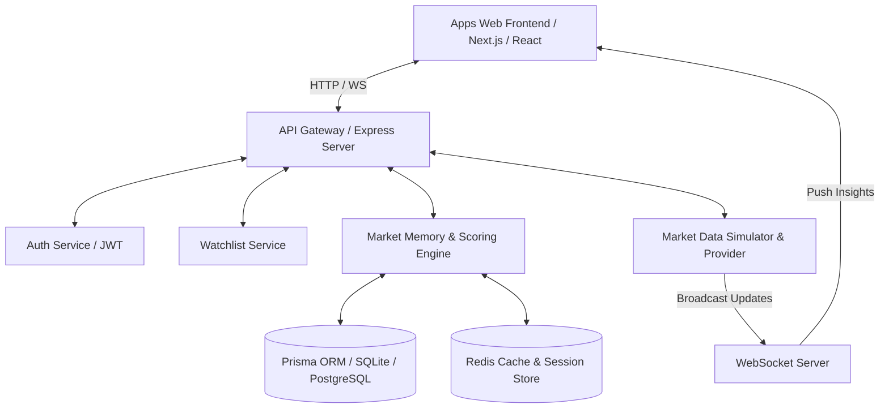
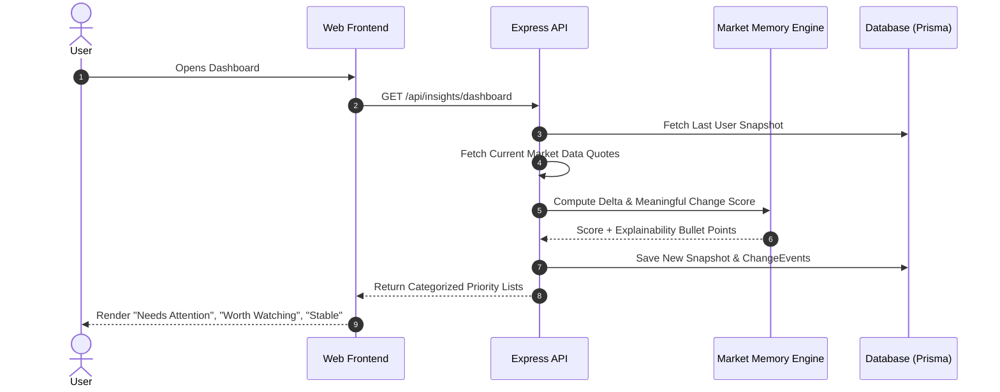

# PulseWatch Architecture & Blueprint

## System Overview
PulseWatch is built around a **Market Memory Engine** that shifts stock watchlists from high-noise live tickers into an actionable insight system. The system captures historical snapshots per user visit, runs deterministic scoring against multi-factor data streams, and ranks changes by attention priority.

## Core Service Architecture

### 1. Market Memory Engine
- **Snapshot Creation**: Every user visit records a `WatchlistSnapshot` with ticker details (Price, Change, Volume, News, Volatility, Sentiment).
- **Delta Comparison**: Compares the incoming state against the user's `LastKnownSnapshot`.
- **Event Generation**: Generates structured `ChangeEvent` records when delta thresholds cross noise filters.

### 2. Meaningful Change & Explainability Engine
The deterministic scoring formula yields a **Meaningful Change Score (0 - 100)**:
$$\text{Score} = (0.30 \cdot S_{\text{price}}) + (0.20 \cdot S_{\text{volume}}) + (0.15 \cdot S_{\text{news\_act}}) + (0.15 \cdot S_{\text{news\_sent}}) + (0.10 \cdot S_{\text{volatility}}) + (0.05 \cdot S_{\text{tech}}) + (0.05 \cdot S_{\text{interest}})$$

#### Explainability Generation Rule Matrix
- `Price Movement >= 4%` -> "Price dropped X% / surged X%" (Weight: 35)
- `Volume Ratio >= 2.0x` -> "Trading volume is Xx above 30-day average" (Weight: 30)
- `Negative News Sentiment` -> "Negative market news / regulatory filing detected" (Weight: 20)
- `52-Week High/Low` -> "Approaching 52-week high resistance" (Weight: 15)

### 3. Attention Priority Breakdown
- 🟥 **Needs Attention** (`Score > 80`): Critical movements needing immediate investor review.
- 🟧 **Worth Watching** (`Score 50-80`): Significant movements worth monitoring.
- 🟨 **Minor Changes** (`Score 20-50`): Moderate fluctuations.
- 🟩 **Stable** (`Score < 20`): Insignificant noise.

---

## Data Flow Diagram

